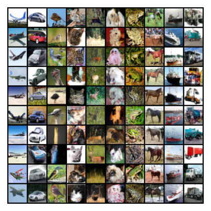
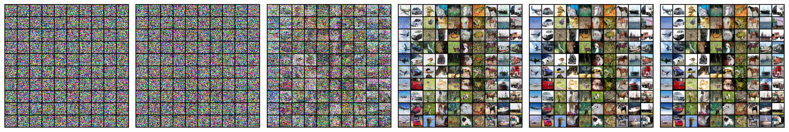

# Pytorch による Score-Based Model (SBM) のシンプルな実装

CIFAR-10 を用いた Score-Based Model の実装および生成・評価コードです．



## SBM の概要

生成したいデータが何らかの確率分布 $p(\mathbf{x})$ に従っていると仮定します．  
SBM は確率分布そのものではなく，その対数勾配（スコア）
$\nabla_{\mathbf{x}} \log p(\mathbf{x})$
を学習し，学習したスコアを用いたランジュバン・モンテカルロ法による探索でデータを生成します．

---

一般に生成したいデータが従う分布 $p(\mathbf{x})$ は未知なため，その対数勾配の計算は困難です．そこで SBM では元データ $\mathbf{x}$ に対してガウス分布に従うノイズ
$\mathbf{\epsilon} \sim \mathcal{N}(\mathbf{0}, \sigma^2 \mathbf{I})$
を加えた

$$
\tilde{\mathbf{x}} = \mathbf{x} + \mathbf{\epsilon}
$$

が従う確率分布 $p_{\sigma}(\tilde{\mathbf{x}}|\mathbf{x})$ のスコアを学習します．
$p_{\sigma}(\tilde{\mathbf{x}}|\mathbf{x})$ は平均 $\mathbf{x}$，分散 $\sigma^{2}\mathbf{I}$ のガウス分布

$$
p_{\sigma}(\tilde{\mathbf{x}}|\mathbf{x}) = \frac{1}{(2\pi)^{D/2}\sigma^{D}} 
\exp\left(-\frac{\|\tilde{\mathbf{x}} - \mathbf{x}\|^2}{2\sigma^2}\right)
$$

となるため，その対数勾配は

$$
\nabla_{\tilde{\mathbf{x}}} \log p_{\sigma}(\tilde{\mathbf{x}}|\mathbf{x}) 
= - \frac{\tilde{\mathbf{x}} - \mathbf{x}}{\sigma^2}
= - \frac{\mathbf{\epsilon}}{\sigma^2}
$$

このように解析的に求めることができます． SBM はこの容易に求められるスコアを学習目標とし，ニューラルネットワーク等で表したパラメータ $\theta$ を持つスコア関数を学習します．

---

生成したいデータは高次元なことがほとんど（例えば数字画像の MNIST なら $28 \times 28 = 784$ 次元）なため，多様体仮説より，データが従う分布のほとんどがノイズのような状態（低密度領域）であり，ごく一部分の領域にのみ望んだデータが集中して（高密度領域）存在していると考えられています． 
そのため，探索の初期値は低密度領域である可能性が非常に高く，また効率的に高密度領域へ遷移する必要があります．

そのために SBM は次の目的関数を用いて，複数のノイズスケール $\sigma_t$ におけるスコアを学習します．  
ノイズスケールが大きい場合，多峰性分布は単峰性分布とみなせるため，様々なノイズスケール時のスコアを学習することで，低密度から高密度領域まで幅広い領域のスコアを推定可能となります．

$$
\sum_{t=1}^{T} w_t
\mathbb{E}_{\mathbf{x}\sim p(\mathbf{x}), \tilde{\mathbf{x}}\sim \mathcal{N}(\mathbf{x}, \sigma_t^{2}\mathbf{I})}
\left[
\left\|
\frac{\mathbf{x} - \tilde{\mathbf{x}}}{\sigma_t^2} - s_{\theta}(\tilde{\mathbf{x}}, \sigma_t)
\right\|^2
\right]
$$

---

生成時には，大きなノイズスケールから開始し，徐々にノイズを小さくしながらランジュバン・モンテカルロ法によりサンプリングを行います．

$$
\mathbf{x}_{t,k} = \mathbf{x}_{t,k-1} + \alpha_t s_{\theta}(\mathbf{x}_{t,k-1}, \sigma_t) + \sqrt{2\alpha_t}\,\mathbf{u}_k,
\quad \mathbf{u}_k \sim \mathcal{N}(\mathbf{0}, \mathbf{I})
$$

この更新を繰り返すことで，最終的に元の分布 $p(\mathbf{x})$ に従うサンプルを得ることができます．

---

## 環境

- Python 3.10
- PyTorch

依存関係は以下でインストール

```bash
pip install -r requirements.txt
```

## 学習

モデルの学習設定は次の通りです．
なお，以下のパラメータ設定を推奨します．
<br>
sigma_min = 0.01，sigma_max = 50.0

```bash
python3 train.py \
--epochs 500 \
--batch_size 128 \
--lr 1e-4 \
--len_sigma 250 \
--min_sigma 0.01 \
--max_sigma 50.0 \
--save_dir ./SavedModels
```

## 生成

モデルの生成設定の一例は次の通りです．
なお，以下のパラメータ設定を推奨します．
<br>
alpha = 1e-5，K = 5，sigma_min = 0.01，sigma_max = 50.0

```bash
python3 run.py \
--model_path ./SavedModels/UNet_epoch500.pth \
--num_images 100 \
--len_sigma 250 \
--alpha 1e-5 \
--K 5 \
--min_sigma 0.01 \
--max_sigma 50.0 \
--save_dir './created_image' \
--seed 42 \
--labels_all \
--euler \
--save-per 0.2
```

## 生成結果例



## FID評価

Frechet Inception Distance（FID）を用いてモデルの評価を行います．設定は次の通りです．

```bash
python3 fid_run.py \
--model_path ./SavedModels/UNet_epoch500.pth \
--num_images 10000 \
--batch_size 200 \
--len_sigma 250 \
--alpha 1e-5 \
--K 5 \
--min_sigma 0.01 \
--max_sigma 50.0 \
--fid_dir './fid_datas' \
--seed 2026 \
--gamma 3.0 \
--euler
```

上記の設定での評価結果は
FID:  21.25
となりました．